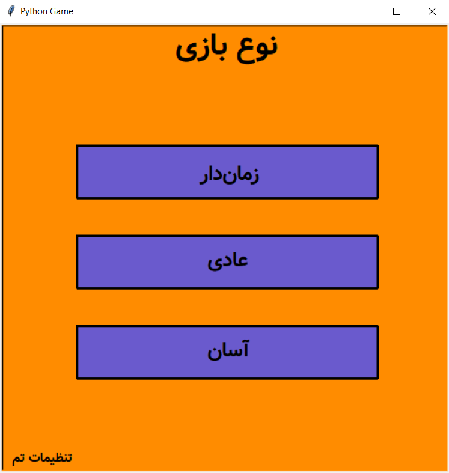
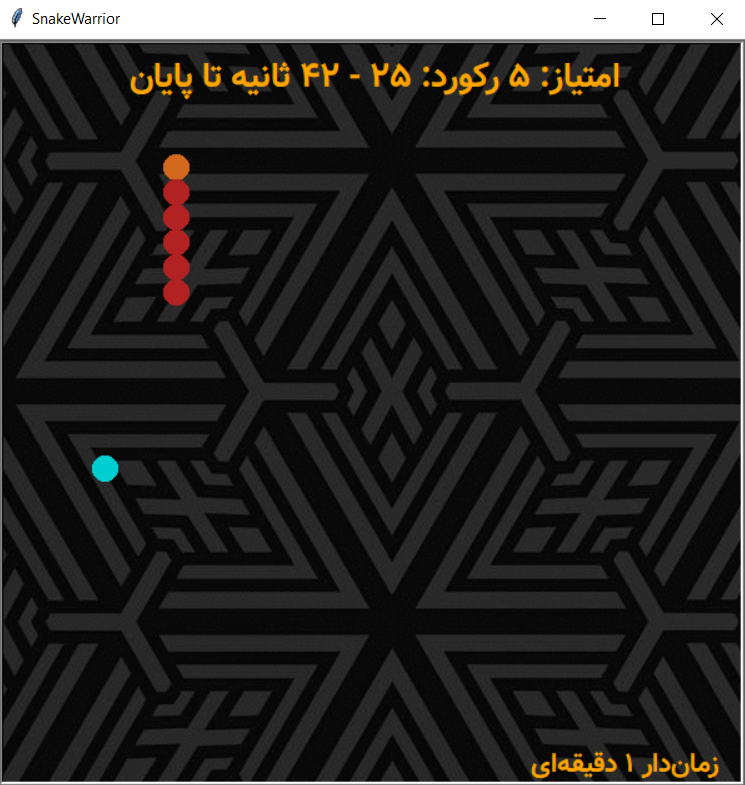
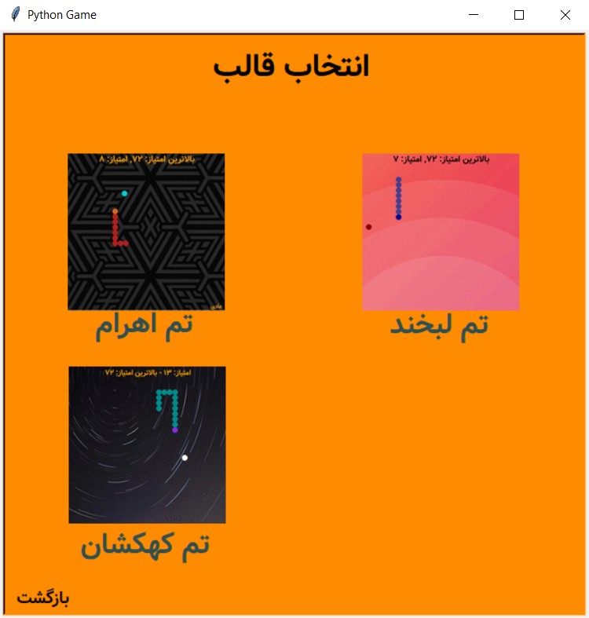

# 🐍 **Advanced Snake Game** 🎮

An upgraded version of the classic Snake game with stunning features for an enhanced experience!

<p align="center">
  
</p>

## 🎨 **Game Features**
- **Color and Theme Selection** 🌈 - Customize your snake and environment colors and save your choices!
- **Multiple Game Modes**:
  - **Easy** 🟢
  - **Timed** ⏲️ with different time settings (in various minutes!)
  - **Normal** 🎲
- **Epic Background Music** 🎶 - Enjoy a vibrant soundtrack to enhance gameplay!
- **Quick Slither Button** (hold **Shift** key) 🚀 - Increase the snake’s speed for an extra thrill!

---

## 🛠️ **Installation and Running Instructions**

### **Setup Steps**
1. Activate the virtual environment:
   ```bash
   venv\Scripts\activate
2. Run the main file:
   ```bash
   python main.py
3. Enjoy the game! 😎🎉
📸 Screenshots
<p align="center"> 
   </p>

## 🚀 **Tips and Recommendations**
Use of vazir bold font for better experience. Just install that, you install from <a href="https://www.fontyab.com/5029/%D9%81%D9%88%D9%86%D8%AA-%D9%88%D8%B2%DB%8C%D8%B1.html">FontYab</a><br>
Customize colors and themes for a more personalized experience.<br/>
Try out the timed modes for a greater challenge!<br/>
Use the Shift key to speed up the snake—beware, it’s fast!<br/>
Enjoy the game and feel free to share your feedback! 🙌

<p align="center">   </p>
